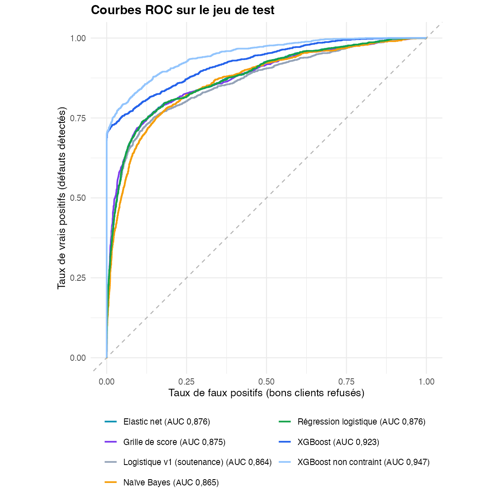
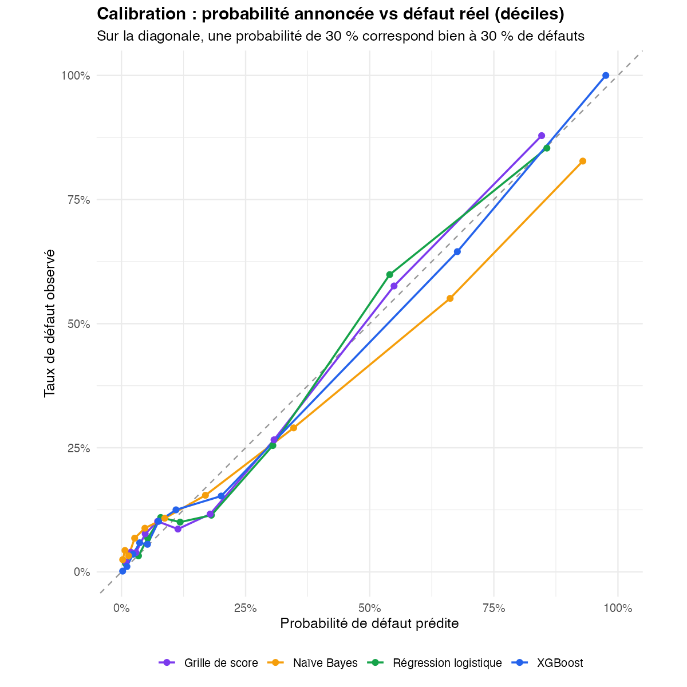
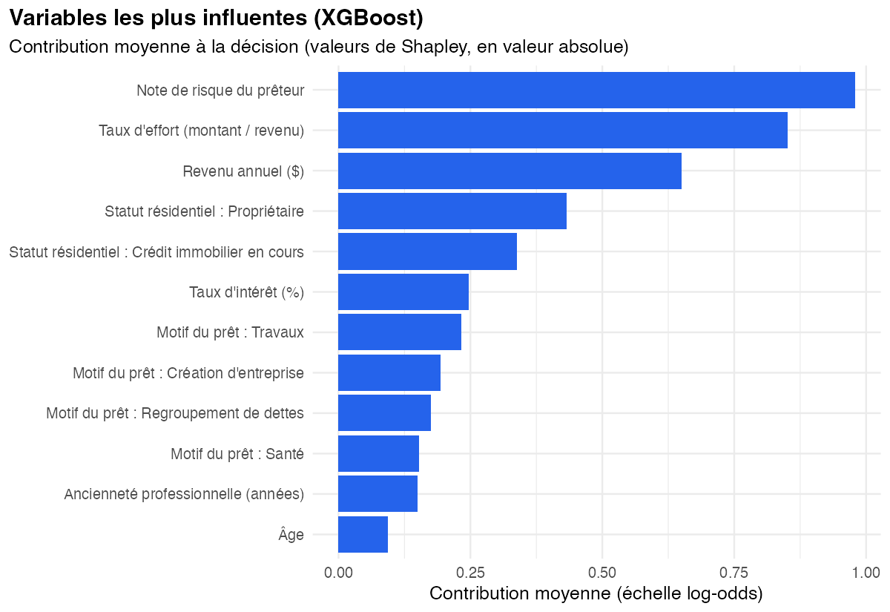
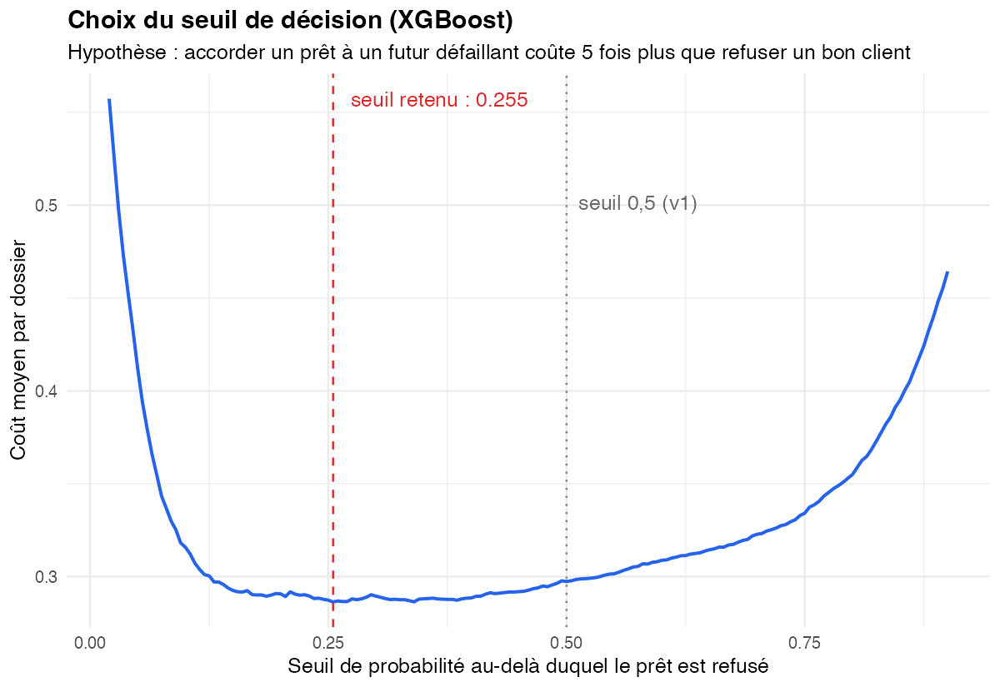

# Scoring de risque de crédit

**Prédire le défaut de remboursement d'un emprunteur, comparer six modèles et expliquer chaque décision.**

[**Ouvrir l'application**](https://credit-risk-app-c8ye.onrender.com) · R · XGBoost · grille de score bancaire · Shiny · Docker · Render

Auteurs : **Mohamed Fofana** et **Abdou Fall** — projet de Compléments de mathématiques, L3 MIASHS, Université Grenoble Alpes (2025-2026), entièrement repris et amélioré en octobre 2026 (version 2). La liste détaillée des changements est dans [CHANGELOG.md](CHANGELOG.md).

📘 **[Guide complet du projet (PDF, 16 pages)](docs/guide_projet.pdf)** : mathématiques, statistiques, algorithmes, code, résultats et mise en production, expliqués pas à pas.

---

## Résultats

Mesurés une seule fois, sur **6 482 dossiers de test** jamais utilisés pour entraîner ni régler les modèles.

| Modèle | AUC [IC 95 %] | Gini | KS | Défauts détectés | Refus justifiés | Coût moyen | Décisions à contresens |
|---|---|---|---|---|---|---|---|
| **XGBoost avec contraintes de cohérence (modèle retenu)** | **0,923** [0,914 ; 0,932] | **0,847** | **0,711** | **76,4 %** | **76,4 %** | **0,310** | **0 %** |
| XGBoost sans contrainte (référence) | 0,947 [0,940 ; 0,954] | 0,895 | 0,742 | 83,4 % | 70,4 % | 0,258 | jusqu'à 23 % |
| Régression logistique | 0,876 [0,865 ; 0,887] | 0,751 | 0,627 | 77,8 % | 57,7 % | 0,368 | jusqu'à 4 % |
| Elastic net | 0,876 [0,864 ; 0,887] | 0,751 | 0,627 | 77,8 % | 57,5 % | 0,369 | |
| Grille de score | 0,875 [0,863 ; 0,886] | 0,750 | 0,624 | 77,9 % | 57,5 % | 0,368 | |
| Naïve Bayes | 0,865 [0,854 ; 0,877] | 0,731 | 0,596 | 78,6 % | 52,1 % | 0,392 | |
| *Logistique v1 (version de soutenance)* | *0,864 [0,852 ; 0,876]* | *0,728* | *0,605* | *58,8 %* | *77,2 %* | *0,489* | |

- **Le modèle retenu n'est pas celui qui a la plus haute AUC.** Sans contrainte, XGBoost atteint 0,947, mais un audit montre qu'il juge un emprunteur **plus risqué quand son revenu augmente** pour 23 % des dossiers de test, et moins risqué quand le montant emprunté augmente pour 19 %. Avec des contraintes de monotonie, ces incohérences tombent à **0 %** pour 2,4 points d'AUC : c'est le prix d'un modèle crédible et défendable devant une banque.
- Le modèle retenu reste **significativement meilleur** que les modèles linéaires et que la version de soutenance (test de DeLong, p < 0,0001) : il **détecte 76 % des défauts au lieu de 59 %**, avec **76 % de refus justifiés**, et **réduit de 37 % le coût des erreurs**.
- **Sans la note de risque attribuée par le prêteur**, il atteint encore une AUC de **0,913** : il apprend réellement des caractéristiques de l'emprunteur.
- Les probabilités annoncées sont **bien calibrées** (figure ci-dessous).

| Courbes ROC | Calibration |
|---|---|
|  |  |

| Variables les plus influentes | Choix du seuil de décision |
|---|---|
|  |  |

**Lecture des indicateurs.** L'AUC est la probabilité qu'un futur défaillant reçoive un score plus risqué qu'un bon payeur ; le Gini (2 × AUC − 1) et le KS sont les indicateurs usuels des banques. Le **coût moyen** suppose qu'accorder un prêt à un futur défaillant coûte **5 fois** plus que refuser un bon client ; chaque modèle utilise le seuil qui minimise ce coût en validation croisée.

---

## L'application

| Onglet | Contenu |
|---|---|
| **Simulateur** | Saisie d'un dossier, décision recommandée, probabilité de défaut, **explication de la décision** (valeurs de Shapley), score de la **grille bancaire** détaillé point par point, avis des cinq modèles |
| **Comparaison des modèles** | Tableau des performances, courbes ROC, calibration, importance des variables, analyse sans la note du prêteur |
| **Exploration des données** | Distribution de chaque variable selon le statut du prêt, taux de défaut par modalité |
| **Méthode** | Protocole, nettoyage, hypothèses et limites |

Elle est entièrement en français, contrôle chaque saisie (bornes, cohérence âge / ancienneté, montant / revenu) et signale les dossiers qui sortent du domaine des données d'entraînement.

---

## Méthode

1. **Données** — [Credit Risk Dataset](https://www.kaggle.com/datasets/laotse/credit-risk-dataset) (Kaggle), 32 581 prêts. Variables et modalités renommées en français. 165 doublons exacts, 5 âges supérieurs à 100 ans et 2 anciennetés professionnelles incompatibles avec l'âge retirés : **32 409 dossiers**, 21,9 % de défauts.
2. **Découpage** stratifié 80 / 20 *avant* toute transformation. Le jeu de test n'est touché qu'une fois, à la fin.
3. **Valeurs manquantes** (taux d'intérêt : 9,5 % ; ancienneté : 2,7 %) remplacées par la médiane de l'échantillon d'apprentissage, avec un indicateur « non renseigné » conservé comme information. Cette préparation est réapprise dans chaque pli de validation croisée.
4. **Six modèles**, évalués avec les **mêmes 5 plis** de validation croisée :

   | Modèle | Réglage |
   |---|---|
   | Logistique v1 | reproduction fidèle de la version de soutenance, pour mesurer le progrès |
   | Naïve Bayes | densités par noyau (AUC CV 0,872 contre 0,847 en gaussien) |
   | Régression logistique | logarithme des montants, indicateurs de valeurs manquantes |
   | Elastic net | alpha et lambda choisis par validation croisée |
   | Grille de score | discrétisation et WoE, sélection par valeur d'information, coefficients de signe cohérent imposés, points (600 points = 5 % de risque, 50 points doublent la cote) |
   | XGBoost | profondeur et poids minimal réglés (6 combinaisons avec contraintes, 6 sans), nombre d'arbres fixé par arrêt précoce |

5. **Seuil de décision** choisi sur les prédictions hors pli pour minimiser le coût attendu, jamais sur le jeu de test.
6. **Explicabilité** : valeurs de Shapley de XGBoost, à l'échelle du modèle et de chaque dossier.

**Choix assumés.**
- **Contraintes de monotonie** : toutes choses égales par ailleurs, le risque ne peut que croître avec le montant, le taux d'effort, le taux d'intérêt, la note et un défaut antérieur, et baisser quand le revenu augmente. Un audit automatique (`resultats/coherence.csv`) et les tests (`tests/tests.R`) le vérifient sur tous les dossiers de test. Une variante sans le revenu brut a aussi été testée : AUC de 0,884 seulement, car le revenu apporte une information propre.
- Dans la grille de score, le défaut antérieur obtenait un coefficient négatif (il est déjà contenu dans la note du prêteur) : il est retiré, comme le veut la pratique bancaire, plutôt que de donner des points absurdes.

**Limites.**
- **Le jeu de données est en partie simulé.** Il contient des règles quasi déterministes : par exemple, **100 % de défaut** chez les 1 154 locataires notés A ou B dont le taux d'effort dépasse 32 %. Aucun portefeuille réel ne se comporte ainsi ; les modèles apprennent ces règles, ce qui gonfle les performances. Elles ne se transposeraient pas telles quelles à une banque.
- Données sans date : impossible de vérifier la stabilité du modèle dans le temps.
- Le ratio de coût 5 pour 1 est une hypothèse qu'une banque calibrerait sur ses pertes réelles.
- L'application est un outil pédagogique, pas une décision de crédit.

---

## Structure du dépôt

```
├── R/
│   ├── fonctions.R              découpage stratifié, AUC, Gini, KS, Brier, coût, seuil optimal
│   ├── 01_preparation.R         lecture, renommage, nettoyage, découpage apprentissage / test
│   ├── 02_modelisation.R        réglage et validation croisée des six modèles
│   ├── 03_evaluation.R          mesures sur le test, tests de DeLong, figures
│   ├── 04_export_application.R  modèles allégés + contrôle de reproduction exacte
│   ├── 05_chiffres_document.R   chiffres du guide, extraits des résultats
│   └── executer_tout.R          enchaîne les cinq étapes
├── tests/tests.R                26 tests automatiques (saisies, préparation, prédictions, cohérence, grille)
├── app/
│   ├── app.R                    application Shiny
│   ├── preparation.R            préparation des données, partagée avec l'entraînement
│   ├── modeles_application.R    prédiction, grille de points, explications
│   └── modeles/                 modèles exportés (2,3 Mo)
├── donnees/credit_risk_dataset.csv
├── resultats/                   tableaux (CSV), figures, versions des paquets
├── docs/guide_projet.pdf        guide complet (source LaTeX + chiffres générés par R/05)
├── rapport_L3/                  rapport, script, application et soutenance d'origine (avril 2026)
├── Dockerfile                   image de production
└── .github/workflows/           maintien de l'application éveillée sur Render
```

La préparation des données n'est écrite qu'une fois (`app/preparation.R`) et utilisée à la fois pour l'entraînement et dans l'application. L'export vérifie que l'application reproduit **exactement** les prédictions de l'entraînement sur les 6 482 dossiers de test.

---

## Reproduire les résultats

```bash
# R 4.5 ; paquets : naivebayes, glmnet, xgboost, scorecard, pROC, ggplot2, shiny, bslib
Rscript R/executer_tout.R          # environ 3 minutes : données -> modèles -> évaluation -> application
Rscript tests/tests.R              # 26 tests automatiques
Rscript -e 'shiny::runApp("app")'  # lancer l'application en local
```

Toutes les étapes aléatoires sont fixées par une graine (2026) : les chiffres ci-dessus se retrouvent à l'identique.

## Déploiement

L'application tourne sur **Render** (offre gratuite) à partir du `Dockerfile` :

- image R minimale (`rocker/r-ver`, 365 Mo contre 580 Mo pour `rocker/shiny` auparavant) et paquets **précompilés** figés à la date d'entraînement ;
- seulement 5 paquets et 2,3 Mo de modèles chargés une fois au démarrage (la v1 rechargeait un modèle de 40 Mo à chaque prédiction) : l'application est prête en moins de 2 secondes une fois le conteneur lancé ;
- l'offre gratuite de Render endort le service après 15 minutes sans visite (72 secondes de réveil mesurées) : la tâche [`reveil-render.yml`](.github/workflows/reveil-render.yml) l'appelle toutes les 10 minutes pour qu'un visiteur n'attende pas.

**Sécurité.** Toutes les saisies sont revérifiées côté serveur (Shiny ne contrôle pas que la valeur d'une liste déroulante fait partie des choix proposés), les messages d'erreur techniques sont masqués, le conteneur tourne sans droits d'administrateur et l'application ne conserve aucune donnée saisie.

## Version de soutenance

La version présentée en avril 2026 est conservée à l'identique sous l'étiquette git [`v1-soutenance`](../../tree/v1-soutenance), et ses fichiers sont archivés dans `rapport_L3/`.
